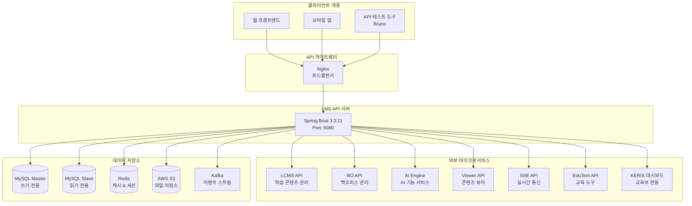
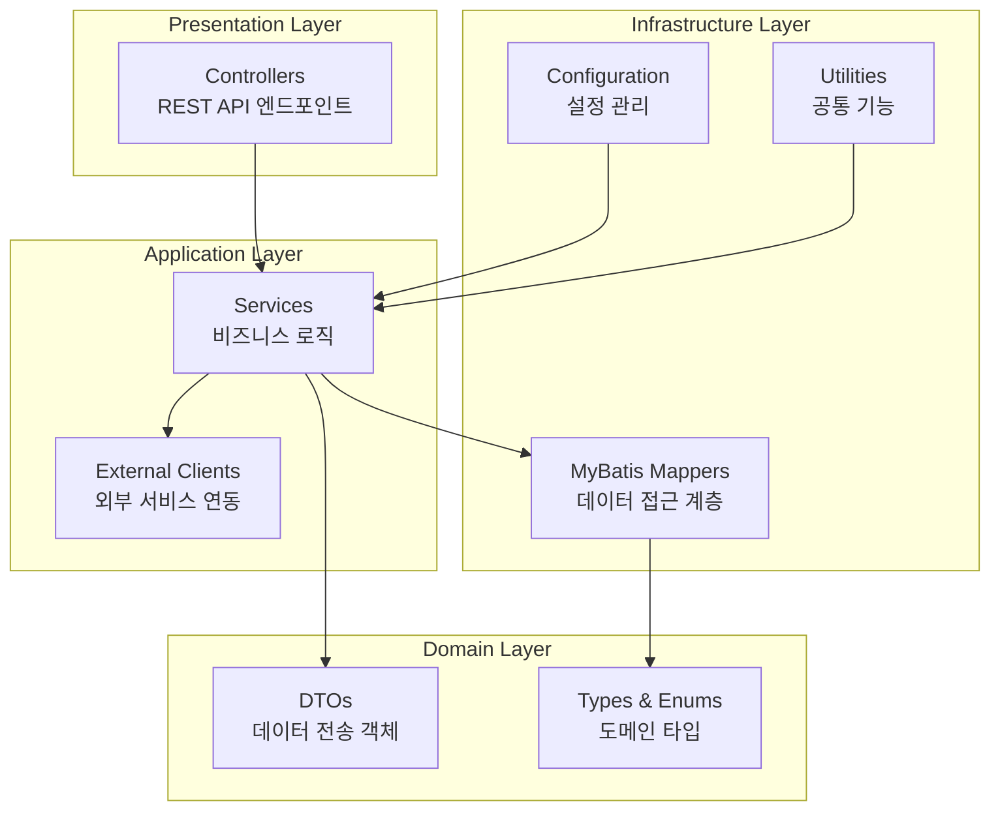
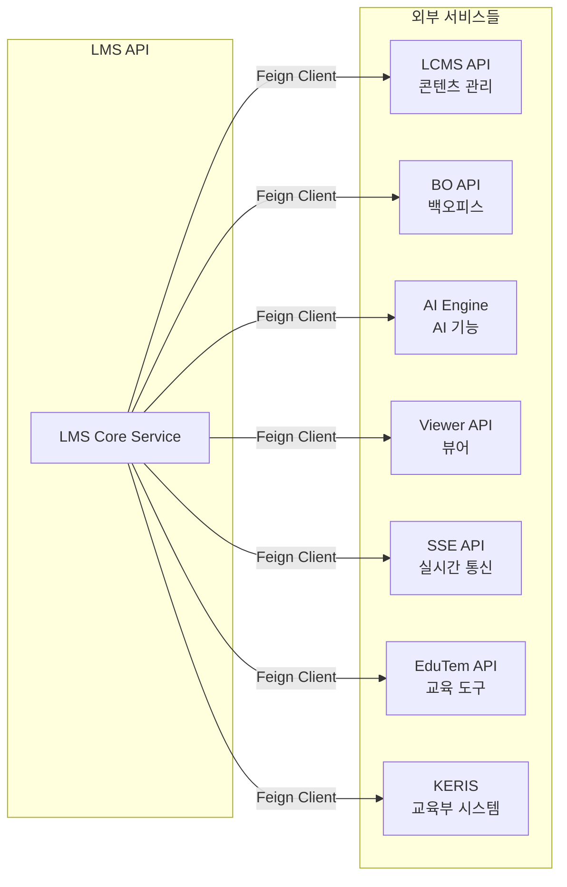
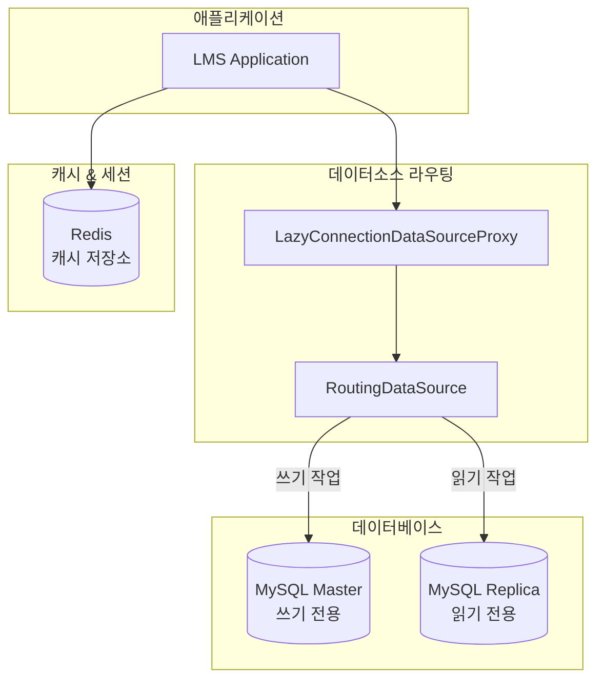
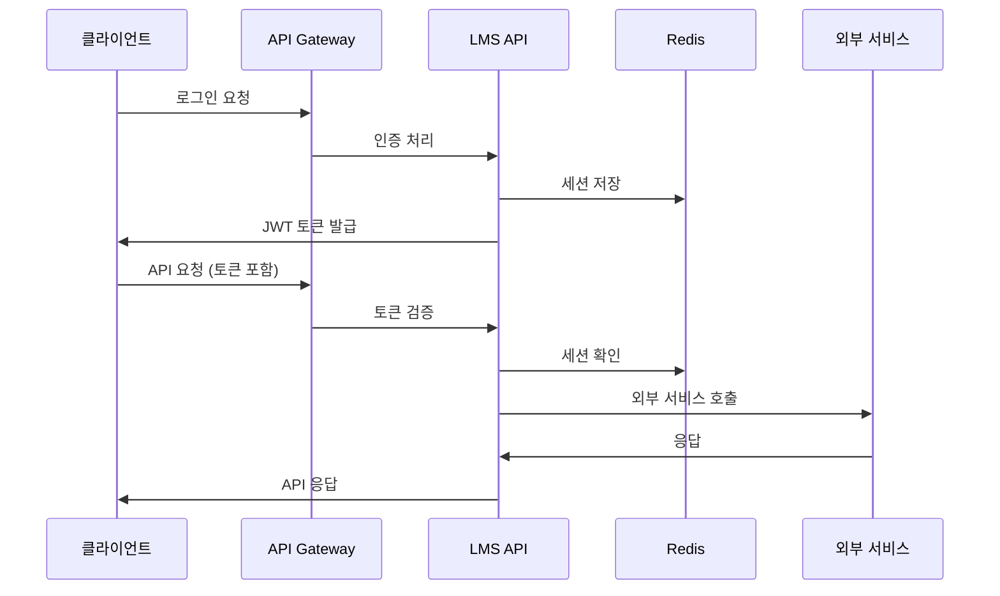
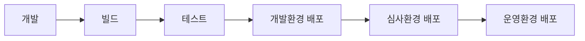

# aidt-lms-code-guide

## 📖 개요

AIDT LMS API는 AI 기반 교육 플랫폼을 위한 Learning Management System의 핵심 백엔드 서비스입니다. 현재는 모놀리식 아키텍처로 구성되어 있으며, 향후 마이크로서비스로 전환할 수 있도록 도메인별로 구조화되어 있습니다.

## 🏗️ 시스템 아키텍처

### 전체 시스템 구조



### 내부 아키텍처 (계층형 구조)



## 🔄 마이크로서비스 간 통신

### 1. 외부 서비스 연동 구조



### 2. 통신 방식별 분류

#### 동기 통신 (Feign Client)
- **LCMS Client**: 학습 콘텐츠, 교과서, 모듈 관리
- **BO Client**: 백오피스 기능 (FAQ, 공지사항, 1:1 문의)
- **AI Client**: AI 분석, 요약, 추천 기능
- **Viewer Client**: 콘텐츠 뷰어 연동
- **Edu Client**: AI Writing 문법 교정
- **KERIS Client**: 교육부 대시보드 데이터 전송

#### 비동기 통신
- **SSE Client**: 실시간 활동 데이터 전송
- **Kafka**: 이벤트 스트리밍 (로그, 사용자 행동 데이터)

### 3. 클라이언트별 주요 기능

| 클라이언트 | 주요 기능 | 통신 방식 |
|-----------|----------|-----------|
| **AIClient** | - AI 누가기록 요약<br/>- AI 보조교사 대시보드<br/>- AI 교과 평어 생성 | REST API |
| **BoClient** | - 1:1 문의 관리<br/>- FAQ 관리<br/>- 공지사항 관리<br/>- 파일 업로드 이력 | REST API |
| **LcmsClient** | - 표준 코스 정보<br/>- 콘텐츠 조회<br/>- 지식맵 관리<br/>- AI 학습관 데이터 | REST API |
| **ViewerClient** | - AI 평가 학생 추가 | REST API |
| **SseClient** | - 실시간 활동 데이터 전송 | Server-Sent Events |
| **EduClient** | - AI Writing 문법 교정 | REST API |
| **KerisDashBrdClient** | - 교육부 학습 데이터 전송<br/>- 진도율, 완료율 보고 | REST API |

## 📊 데이터베이스 구조

### 데이터소스 구성



### 주요 테이블 구조 (도메인별)

#### 사용자 관리 도메인
- **사용자 기본 정보**: 교사/학생 계정 관리
- **권한 관리**: 역할 기반 접근 제어
- **프로필 관리**: 사용자 프로필 및 설정

#### 학급/강의 관리 도메인
- **학급 정보**: 학급 구성 및 관리
- **강의 정보**: 강의 계획 및 진도 관리
- **출석 관리**: 수업 참여 현황

#### 과제/활동 도메인
- **과제 관리**: 과제 생성, 배포, 제출, 평가
- **활동 관리**: 학습 활동 및 실시간 참여
- **평가 관리**: 다양한 평가 방식 지원

#### AI 기능 도메인
- **AI 평가**: 자동 평가 및 분석
- **AI 학습관**: 개인화 학습 추천
- **AI 분석**: 학습 패턴 분석

## 🔒 보안 및 인증

### 인증 체계



### 보안 기능
- **JWT 토큰 기반 인증**
- **Redis 세션 관리**
- **Spring Security 권한 제어**
- **Jasypt 설정 암호화**
- **XSS/SQL Injection 방지**

## 🌐 환경별 구성

### 개발 환경 (dev)
- **URL**: `https://dev.d-aidt.com/lms-api`
- **데이터베이스**: 개발용 MySQL
- **외부 서비스**: 개발 환경 엔드포인트
- **로깅**: DEBUG 레벨
- **Swagger**: 활성화

### 운영 환경 (prod)
- **URL**: `https://www.aidt.ai/lms-api`
- **데이터베이스**: 운영용 MySQL (읽기/쓰기 분리)
- **외부 서비스**: 운영 환경 엔드포인트
- **로깅**: INFO 레벨
- **Swagger**: 비활성화

### 심사 환경 (audit)
- **URL**: `https://www.s-aidt.com/lms-api`
- **데이터베이스**: 심사용 MySQL
- **모니터링**: 강화된 로깅

## 📋 주요 API 그룹

### 1. 인증/사용자 관리
```
POST /auth/login          # 로그인
POST /logout              # 로그아웃
GET  /auth/crs           # 사용자 코스 정보
GET  /user/info          # 사용자 정보 조회
```

### 2. 교과서/콘텐츠 관리
```
GET  /txbk/chpts         # 교과서 챕터 조회
POST /txbk/sync          # 교과서 동기화
GET  /txbk/mduls         # 모듈 목록 조회
```

### 3. 과제 관리
```
GET  /asmt               # 과제 목록 조회
POST /asmt               # 과제 생성
PUT  /asmt/{id}          # 과제 수정
DELETE /asmt/{id}        # 과제 삭제
```

### 4. 활동 관리
```
GET  /actv               # 활동 목록 조회
POST /actv               # 활동 생성
PUT  /actv/{id}          # 활동 수정
```

### 5. AI 기능
```
POST /ai/assistant/summary    # AI 보조교사 요약
GET  /ai-evl/insight-card    # AI 평가 인사이트
POST /ai-lsctr/deploy        # AI 학습관 배포
```

### 6. 대시보드/분석
```
GET  /glance/teacher     # 교사 대시보드
GET  /glance/student     # 학생 대시보드
GET  /glance/statistics  # 통계 정보
```

## 🚀 배포 및 운영

### CI/CD 파이프라인


### 모니터링
- **헬스 체크**: `/actuator/health`, `/health`
- **메트릭**: JVM, 데이터베이스 연결 풀
- **로깅**: 구조화된 로그 (SLF4J + Logback)

## 🔮 향후 마이크로서비스 전환 계획

### 예상 서비스 분리
1. **User Service**: 사용자 관리, 인증
2. **Classroom Service**: 학급, 강의, 과제, 활동
3. **Content Service**: 교과서, 콘텐츠 관리
4. **AI Service**: AI 평가, 학습, 추천
5. **Analytics Service**: 대시보드, 리포트, 통계

### 마이크로서비스 전환 시 고려사항
- **API Gateway 도입**: 라우팅, 인증, 로드밸런싱
- **Service Discovery**: 서비스 검색 및 등록
- **분산 트랜잭션**: 데이터 일관성 보장
- **Event-Driven Architecture**: 비동기 통신 강화
- **Circuit Breaker**: 장애 격리 및 복구

## 📚 개발 가이드

### 개발 환경 설정
```bash
# 프로젝트 클론
git clone <repository-url>
cd aidt-lms-api

# 의존성 설치 및 빌드
./gradlew clean build

# 개발 서버 실행
./gradlew bootRun --args='--spring.profiles.active=dev'
```

### 코드 구조
```
src/main/java/ai/aidt/lms/api/
├── controller/          # REST API 컨트롤러
├── service/            # 비즈니스 로직
├── serviceImpl/        # 서비스 구현체
├── client/             # 외부 서비스 클라이언트
├── dto/                # 데이터 전송 객체
├── config/             # 설정 클래스
├── util/               # 유틸리티 클래스
└── type/               # 타입 정의
```

### API 문서
- **Swagger UI**: `http://localhost:8080/lms-api/swagger/swagger-ui` (개발 환경만)
- **Bruno 컬렉션**: `bruno/` 디렉토리의 API 테스트 파일들

이 가이드는 AIDT LMS API의 전체적인 시스템 구조와 마이크로서비스 간 통신 방식을 이해하는데 도움이 될 것입니다.